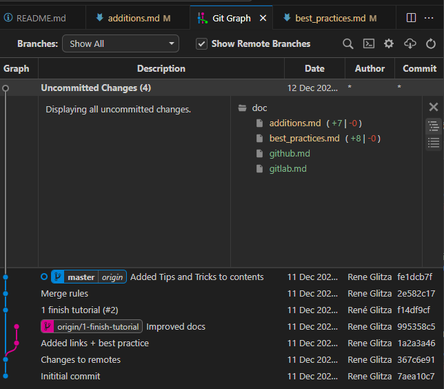

# Tips und Tricks
Back to [Readme](../README.md)
* Section [GitHub](github.md)
* Section [GitLab](gitlab.md)

## VS Code Extensions

### GitGraph
The Git Graph extension allows you to visualize your repository's Git history.




## Git Submodule
Submodules are a way to keep a Git repository as a subdirectory of another Git repository. This allows you to clone another repository into your project and keep your commits separate.

### Add Submodule
```bash
git submodule add <url> <path>
```

### Update Submodule
```bash
git submodule update --init --recursive
```

### Remove Submodule
```bash
git submodule deinit <path>
git rm <path>
```

## Git Aliases
### Add Alias
```bash
git config --global alias.<alias> <command>
```

### List Aliases
Git stores aliases in the `~/.gitconfig` file.
```ini
[alias]
	update = !git pull && git submodule update --init --recursive
```

## Interactive Rebase
The interactive rebase allows you to edit, squash, delete, and reorder commits.

### Start Interactive Rebase
```bash
# Rebase the last n commits
git rebase -i HEAD~n
```
Explanation:
- Each commit is represented by a line in the editor.
- The first word on each line is the command.
- The second word on each line is the commit hash.
- The third word on each line is the commit message.

Changes:
- `pick` -> `pick`: Keep the commit.
- `pick` -> `drop`: Delete the commit.
- `pick` -> `reword`: Change the commit message.
- `pick` -> `squash`: Combine the commit with the previous commit.
- `pick` -> `fixup`: Combine the commit with the previous commit and discard the commit message.
- `pick` -> `edit`: Stop the rebase to edit the commit (amend).

After changing your git history, it might be necessary to use a force push to origin for the next push.

### Continue Interactive Rebase
```bash
# Continue the rebase
git rebase --continue
```

### Abort Interactive Rebase
```bash
# Abort the rebase
git rebase --abort
```

### Edit Commit
```bash
# Edit the commit
git commit --amend
```

## Deploy Keys
Deploy keys allow read-only or read-write access to a repository. They are useful for automated deployments or continuous integration systems.