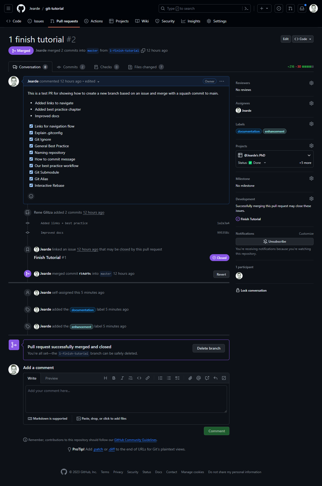
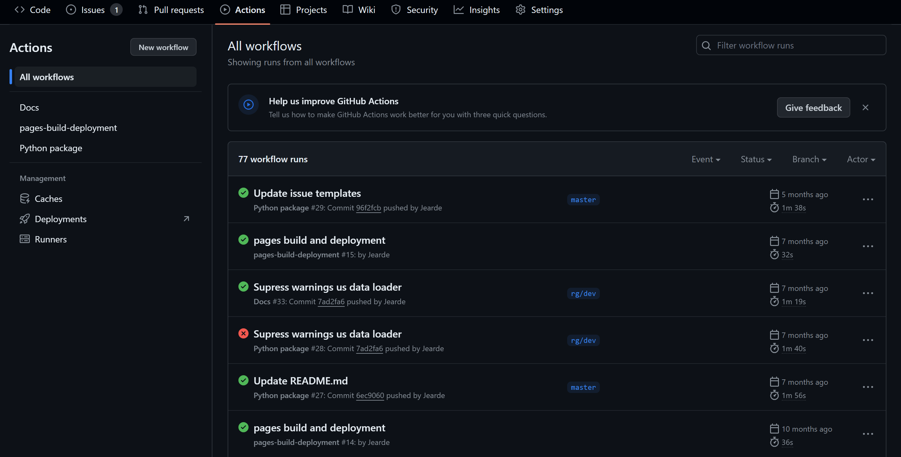
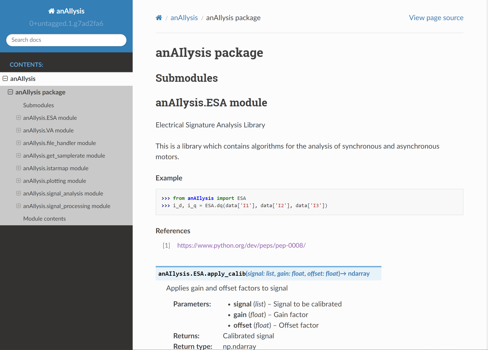

# How to use GitHub

GitHub featurs a lot of features which cannot be covered in this tutorial. This section will cover the most important ones (for our workflow).

## Pull Request

## Protected Branches

Protected branches are available in public and private repositories. They help repository administrators enforce a policy that code checked into specific branches passes certain rules. For example, you might want to require that all code checked into the master/main branch passes code review and a set of automated tests.

1. Access Control:
    - Only authorized users or teams are allowed to push changes to the protected branch.
    - Protecting a branch typically involves specifying users, teams, or roles that have the necessary permissions.
2. Required Status Checks:
    - You can configure required status checks that must pass before changes can be merged into the protected branch.
    - Common status checks include automated tests, code quality checks, and code review approvals.
3. Required Reviews:
    - You can mandate that a specific number of code reviews or approvals from designated individuals or teams are needed before merging.
    - This ensures that code changes are reviewed and accepted by peers before being merged.
4. Enforcement of Linear History:
    - Some platforms allow you to enforce a linear commit history, meaning changes can only be merged if they can be fast-forwarded without creating merge commits.
    - This encourages a cleaner, more straightforward history.
5. Restrictions on Force Push:
    - Force pushing (overwriting the history of a branch) can be restricted to prevent accidental or malicious data loss.
    - Only authorized users should be able to force push.
6. Branch Deletion Protection:
    - Protection can also be extended to prevent accidental deletion of protected branches.

## GitHub Projects
Projects help you organize and prioritize your work. You can create project boards for specific feature work, comprehensive roadmaps, or even release checklists. With project boards, you have the flexibility to create customized workflows that suit your needs.

## GitHub Actions
Actions are individual tasks that you can combine to create jobs and customize your workflow. 
The jobs can be triggered by events (e.g. push, pull request, ...) or on a schedule.
They can be used for e.g. automated testing, building, or deployment.

They are defined by a YAML file in the `.github/workflows` directory.

## GitHub Pages
GitHub Pages is a static site hosting service designed to host your personal, organization, or project pages directly from a GitHub repository.
They can be used for e.g. documentation, blogs, or websites.

## GitHub Wiki
Wikis are a good place to store important information that is not directly related to the codebase, but is still relevant to the project.
They can be used for e.g. documentation, tutorials, or FAQs.